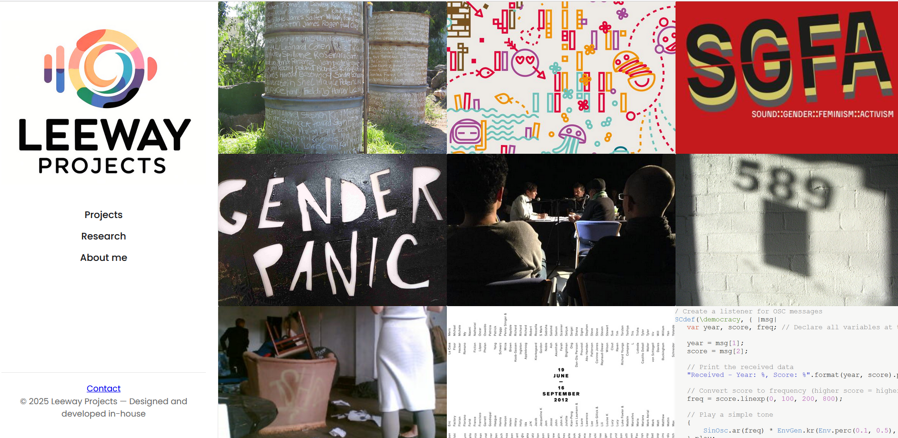
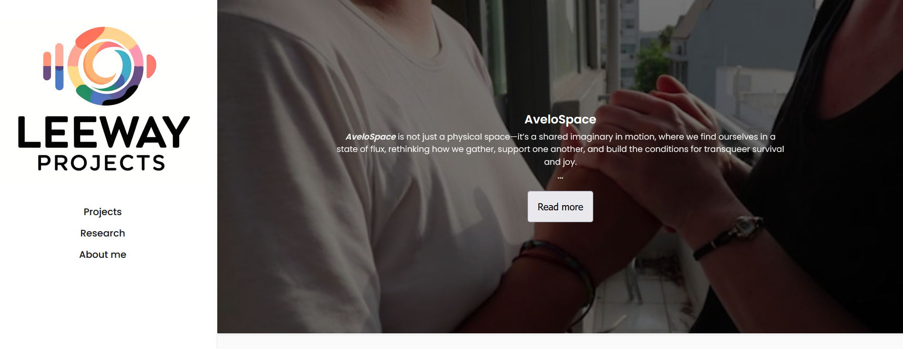

# Leeway Projects Website

Live site: [https://leewayprojects.github.io/](https://leewayprojects.github.io/)

> **Note:** This repository is maintained solely by the project owner. Public viewing only.

---

## Screenshots

### Homepage


### Project Overlay


### Responsive


---

## Project Structure

```
/leewayprojects.github.io
├── assets/
│   ├── images/          # Project images and screenshots
│   │   ├── avelospace/
│   │   ├── code-red/
│   │   ├── projects/
│   │   └── screenshots/
├── projects/            # Project pages
│   ├── project1.html
│   ├── project2.html
│   └── project-style.css # Project page specific styles
├── index.html           # Homepage
├── about.html           # About page
├── research.html        # Research page
├── pedagogy.html        # Education page
├── README.md            # Project documentation
├── script.js            # JavaScript for interactivity (mobile toggle, filters)
└── style.css            # Custom CSS files
```

---

## Design & Styling

- **Typography**: Poppins font for a clean, modern look.
- **Layout**: Responsive grid system for projects and cards.
- **Color Scheme**: Neutral background with accent highlights.

---

## HTML Structure

- **Sidebar**: Navigation links.
- **Main**: Content relevant to each page (projects, research, pedagogy).
- **Footer**: Contact information.
- **Grid Items**: Each project represented as a card with image and overlay.

---

## CSS Styling

- **Global Styles**: Base typography, colors, spacing.
- **Component Styles**: Sidebar, grid items, overlays.
- **Responsive**: Media queries for mobile screens, sidebar toggle.

---

## JavaScript Functionality

- **Mobile Navigation**: Sidebar toggle button for small screens.
- **Interactive Content**: Project Data.
- **Accessibility**: Close sidebar using ESC key.

---

## Deployment

1. The repository is hosted on GitHub.
2. GitHub Pages serves the `main` branch.
3. Any push to `main` automatically updates the live site.


---

## Resources

- [GitHub Pages Documentation](https://pages.github.com/)
- [GitHub Pages Quickstart Guide](https://docs.github.com/en/pages/quickstart)

---

## Contact

For inquiries: [LeewayProjects at proton dot me]


